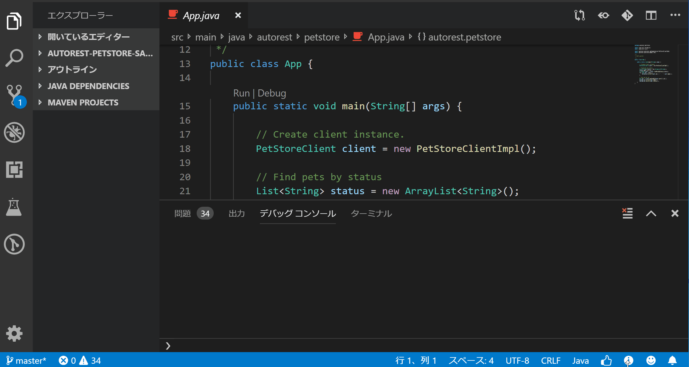

# autorest.java の 生成サンプル

autorest は Microsoft が開発した、OpenAPI(swagger) から、クライアントコードを自動生成するツールで、各言語（C#, Java, Javascript, go , Python）などに対応しています。もともとはAzure SDKを生成するものだったのですが、一般的なクライアント生成にも利用できます。

[Azure/autorest: OpenAPI (f.k.a Swagger) Specification code generator. Supports C#, PowerShell, Go, Java, Node.js, TypeScript, Python, Ruby and PHP.](https://github.com/Azure/autorest)

ここでは、Javaのサンプルを紹介します。各言語はExensionと行った形で提供されており、JavaのExtensionは以下です。

[Azure/autorest.java: Extension for AutoRest (https://github.com/Azure/autorest) that generates Java code](https://github.com/Azure/autorest.java)

Javaでは、Azure向けの生成と一般向けの生成が実装として内部で分かれています。

## 生成と実行

生成手順から実行まで。

### autorest のインストール

npm で autorest をインストール
```sh
npm install -g autorest
```

起動確認
```sh
$ autorest --latest --java
AutoRest code generation utility [version: 2.0.4283; node: v10.16.0]
(C) 2018 Microsoft Corporation.
https://aka.ms/autorest
   Loading AutoRest core      'C:\Users\foo\.autorest\@microsoft.azure_autorest-core@2.0.4390\node_modules\@microsoft.azure\autorest-core\dist' (2.0.4390)
   Loading AutoRest extension '@microsoft.azure/autorest.java' (~2.1.88->2.1.88)
   Loading AutoRest extension '@microsoft.azure/autorest.modeler' (2.3.38->2.3.38)
```

### API Schemaの入手

サンプルとして、swaggerが提供しているものを利用します。`https://editor.swagger.io` を開くと petstore の定義が開かれるので、YAML 化して保存します。autorest は json でも入力できます。（swagger.yml ）

### プロジェクトのひな形用意

maven などで 適当にプロジェクトのひな形を用意しておきます。

### configの準備

すべてを引数で与えることもできますが、Config File を用意しておいた方が簡単です。（autorest.yml)

```yml
input-file:
  - ./swagger.yml

use-extension:
  "@microsoft.azure/autorest.java": "2.1.93"

java:
  - base-folder: .\
    clear-output-folder: false
    namespace: autorest.petstore
    override-client-name: PetStoreClient
    add-credentials: true
    sync-methods: none
    client-side-validation: false
    license-header: |
      Describe license header.
```

本来、 `use-extension` は不要ですが、現状新しいバージョンを取得してくれないので、無理やりそのバージョンを利用するように入れてあります。

### 生成

引数にConfig Fileを指定して生成します。生成フォルダはオプションで指定可能です。デフォルトだと、`generated`になります。

```sh
$ autorest autorest.yml
AutoRest code generation utility [version: 2.0.4283; node: v10.16.0]
(C) 2018 Microsoft Corporation.
https://aka.ms/autorest
   Loading AutoRest core      'C:\Users\foo\.autorest\@microsoft.azure_autorest-core@2.0.4390\node_modules\@microsoft.azure\autorest-core\dist' (2.0.4390)
   Loading AutoRest extension '@microsoft.azure/autorest.java' (2.1.93->2.1.93)
   Loading AutoRest extension '@microsoft.azure/autorest.modeler' (2.3.38->2.3.38)
```

### pom.xml の編集

ポイントとしては以下の2点です

- com.microsoft.rest の依存を追加
- ソースフォルダを複数追加

### サンプル

簡単な呼び出しサンプルは以下の通りです。

```java
public class App {

    public static void main(String[] args) {

        // Create client instance.
        PetStoreClient client = new PetStoreClientImpl();

        // Find pets by status
        List<String> status = new ArrayList<String>();
        status.add("pending");
        List<Pet> pets = client.findPetsByStatus(status);
        for (Pet pet : pets) {
            System.out.println(pet.id() + " :  " + pet.name());
        }

        // Get pet by id
        Pet pet = client.getPetById(pets.get(0).id());
        System.out.println(pet.name());
        System.out.println(pet.status());
    }
}
```


IDE上などから実行してみて結果が取得できることを確認します。



以上